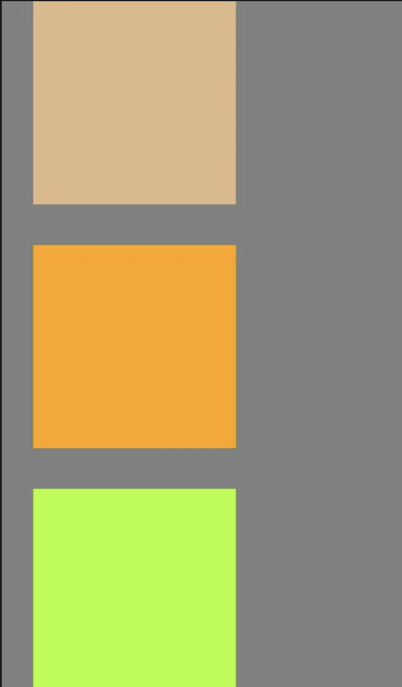
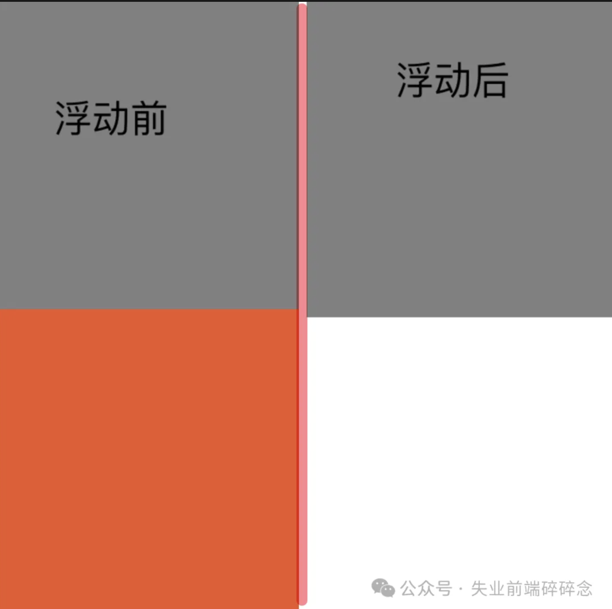
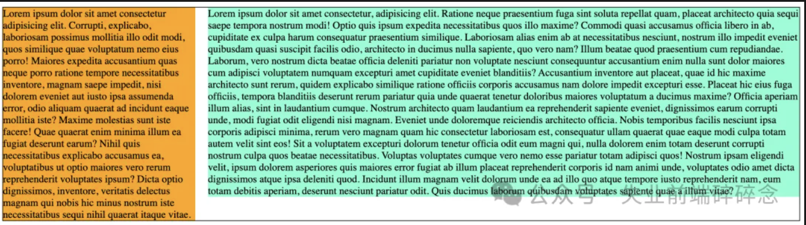

涉及Code repo：[https://github.com/qiqzhao/css-demo](https://github.com/qiqzhao/css-demo)

### 常规流，块元素

1. 水平方向上，撑满整个包行块宽度，垂直方向上，一次摆放
2. 垂直方向上相邻的元素，**margin会合并**
3. 父子关系的情况下，可能会产生 **_margin 塌陷_**
4. 父子关系的情况下，父元素无视浮动元素会产生 **_高度塌陷_**
5. 兄弟关系的情况下，正常元素可能会 **_被浮动元素覆盖_** (正常元素在浮动元素之后)

### BFC (区块格式化上下文 Block Formatting Context)

1. 开启 BFC 的区域，是一块独立的渲染区域

2. 隔绝了内部与外部的联系，内部渲染不会影响到外部

3. 不同的 BFC 区域，渲染时互不干扰

#### 解决的问题
1. 其子元素不会再产生 margin 塌陷问题(不会和他的子元素产生 margin 合并)

2. 就算子元素浮动，自身高度也不会坍塌(高度计算不再无视浮动元素)

3. 自己不会被其他浮动元素所覆盖(不会与浮动元素重叠，会避开元素排布)

#### 如何设置 BFC

0. 根元素 HTML 

1. 设置 float 属性

2. 设置 position 属性(属性值需要是 absolute 或 fixed)

3. 设置 overflow 属性(属性值不为 visible 即可)

4. 行内块元素(inline-block)

5. 设置 display 为 flow-root 的元素

6. 伸缩项目( flex 盒子内的 item)

7. 多列容器(设置 column-count )

8. 表格元素(table thread tbody tfoot tr th td caption)

9. column-span 为 all 的元素(表格第一行横跨所有列)


**margin 塌陷**

```html
<!DOCTYPE html>
<html lang="en">
  <head>
    <meta charset="UTF-8" />
    <meta name="viewport" content="width=device-width, initial-scale=1.0" />
    <title>Document</title>
    <style>
      * {
          margin: 0;
          padding: 0;
      }

      .outer {
        width: 400px;
        background-color: gray;
      }

      .inner {
          width: 100px;
          height: 100px;
          margin: 20px;
      }

        .box1 {
          background-color: burlywood;
      }

        .box2 {
          background-color: orange;
        }

      .box3 {
        background-color: greenyellow;
      }
</style>
  </head>
  <body>
    <div class="outer">
      <div class="inner box1"></div>
      <div class="inner box2"></div>
      <div class="inner box3"></div>
    </div>
  </body>
</html>
```

效果：上面 div 的 margin-top 和下面 div margin-bottom消失



**子元素不动，父元素会产生自身高度的坍塌**

```html
<!DOCTYPE html>
<html lang="en">
  <head>
    <meta charset="UTF-8" />
    <meta name="viewport" content="width=device-width, initial-scale=1.0" />
    <title>Document</title>
    <style>
      * {
        margin: 0;
        padding: 0;
      }
      
      .outer {
        width: 400px;
        background-color: gray;
      }

      .inner {
        width: 100px;
        height: 100px;

        float: left;
      }

      .box1 {
        background-color: burlywood;
      }

      .box2 {
        background-color: orange;
      }

      .box3 {
        background-color: greenyellow;
      }
</style>
  </head>
  <body>
    <div class="outer">
      <div class="inner box1"></div>
      <div class="inner box2"></div>
      <div class="inner box3"></div>
    </div>
  </body>
</html>
```

效果：三个元素 float: left 后，从左到右依次排布，灰色区域消失了


注：

float 后三个元素脱离了文档流，第一个元素占了左浮动的位置，第二个只能放在旁边，第三个只能挨着，所以变成横着的

灰色区域没有脱离文档流，还在正常文档流中，但因为高度为 0，所以看不到


**自己被其他元素覆盖**
```html
<!DOCTYPE html>
<html lang="en">
  <head>
    <meta charset="UTF-8" />
    <meta name="viewport" content="width=device-width, initial-scale=1.0" />
    <title>Document</title>
    <style>
      div {
        width: 200px;
        height: 200px;
      }

      .one {
        background-color: gray;
        float: left;
      }

      .two {
        background-color: orangered;
      }
</style>
  </head>
  <body>
    <div class="one"></div>
    <div class="two"></div>
  </body>
</html>
```
效果


解决方案(注释部分，任一即可)

问题 1 & 2
```css
/* 6 */
/* body {
  display: flex;
} */

.outer {
  width: 400px;
  background-color: gray;

  /* BFC */
  /* 1 */
  /* float: left; */

  /* 2 */
  /* position: absolute; */

  /* 3 */
  /* overflow: auto ; */

  /* 4 */
  /* display: inline-block; */

  /* 5*/
  /* display: flow-root; */

  /* 7 */
  /* column-count: 1; */

  /* 8 */
  /* display: table; */
}
```

问题3
```css
.two {
  background-color: orangered;

  /* BFC */
  /* 1 */
  /* float: left; */

  /* 2 */
  /* position: absolute; */

  /* 3 */
  /* overflow: auto ; */

  /* 4 */
  /* display: inline-block; */

  /* 5*/
  /* display: flow-root; */

  /* 7 */
  /* column-count: 1; */

  /* 8 */
  /* display: table; */
}
```

其中 2，position: absolute 会产生 two 覆盖 one 的问题


#### 总结

display：flow-root；影响最小，但新出属性，存在兼容性问题。

其次影响较小的是 overflow: auto; 


##### 应用

两栏布局
```html
<!DOCTYPE html>
<html lang="en">
<head>
  <meta charset="UTF-8">
  <meta name="viewport" content="width=device-width, initial-scale=1.0">
  <title>Document</title>

  <style>
    .container {
      width: 70%;
      margin: 0 auto;
      border: 1px solid black;
      min-width: 1000px;
    }

    /* 清除 浮动 的影响 */
    .container::after {
      content: '';
      display: block;
      clear: both;
    }

    .left {
      width: 300px;
      background-color: orange;
      float: left;
      margin-right: 20px;
    }

    /* .right {
      width: 300px;
      background-color: orange;
      float: right;
      margin-left: 20px;
    } */

    .main {
      background-color: aquamarine;
      overflow: hidden;
    }
</style>
</head>
<body>
  <div class="container">
    <div class="left">
      Lorem ipsum dolor sit amet consectetur adipisicing elit. Corrupti, explicabo, laboriosam possimus mollitia illo odit modi, quos similique quae voluptatum nemo eius porro! Maiores expedita accusantium quas neque porro ratione tempore necessitatibus inventore, magnam saepe impedit, nisi dolorem eveniet aut iusto ipsa assumenda error, odio aliquam quaerat ad incidunt eaque mollitia iste? Maxime molestias sunt iste facere! Quae quaerat enim minima illum ea fugiat deserunt earum? Nihil quis necessitatibus explicabo accusamus ea, voluptatibus ut optio maiores vero rerum reprehenderit voluptates ipsum? Dicta optio dignissimos, inventore, veritatis delectus magnam qui nobis hic minus nostrum iste necessitatibus sequi nihil quaerat itaque vitae.
    </div>
    <!-- <div class="right">
      Lorem ipsum dolor sit amet consectetur adipisicing elit. Corrupti, explicabo, laboriosam possimus mollitia illo odit modi, quos similique quae voluptatum nemo eius porro! Maiores expedita accusantium quas neque porro ratione tempore necessitatibus inventore, magnam saepe impedit, nisi dolorem eveniet aut iusto ipsa assumenda error, odio aliquam quaerat ad incidunt eaque mollitia iste? Maxime molestias sunt iste facere! Quae quaerat enim minima illum ea fugiat deserunt earum? Nihil quis necessitatibus explicabo accusamus ea, voluptatibus ut optio maiores vero rerum reprehenderit voluptates ipsum? Dicta optio dignissimos, inventore, veritatis delectus magnam qui nobis hic minus nostrum iste necessitatibus sequi nihil quaerat itaque vitae.
    </div> -->
    <div class="main">
      Lorem ipsum dolor sit amet consectetur, adipisicing elit. Ratione neque praesentium fuga sint soluta repellat quam, placeat architecto quia sequi saepe tempora nostrum modi! Optio quis ipsum expedita necessitatibus quos illo maxime? Commodi quasi accusamus officia libero in ab, cupiditate ex culpa harum consequatur praesentium similique. Laboriosam alias enim ab at necessitatibus nesciunt, nostrum illo impedit eveniet quibusdam quasi suscipit facilis odio, architecto in ducimus nulla sapiente, quo vero nam? Illum beatae quod praesentium cum repudiandae. Laborum, vero nostrum dicta beatae officia deleniti pariatur non voluptate nesciunt consequuntur accusantium enim nulla sunt dolor maiores cum adipisci voluptatem numquam excepturi amet cupiditate eveniet blanditiis? Accusantium inventore aut placeat, quae id hic maxime architecto sunt rerum, quidem explicabo similique ratione officiis corporis accusamus nam dolore impedit excepturi esse. Placeat hic eius fuga officiis, tempora blanditiis deserunt rerum pariatur quia unde quaerat tenetur doloribus maiores voluptatum a ducimus maxime? Officia aperiam illum alias, sint in laudantium cumque. Nostrum architecto quam laudantium ea reprehenderit sapiente eveniet, dignissimos earum corrupti unde, modi fugiat odit eligendi nisi magnam. Eveniet unde doloremque reiciendis architecto officia. Nobis temporibus facilis nesciunt ipsa corporis adipisci minima, rerum vero magnam quam hic consectetur laboriosam est, consequatur ullam quaerat quae eaque modi culpa totam autem velit sint eos! Sit a voluptatem excepturi dolorum tenetur officia odit eum magni qui, nulla dolorem enim totam deserunt corrupti nostrum culpa quos beatae necessitatibus. Voluptas voluptates cumque vero nemo esse pariatur totam adipisci quos! Nostrum ipsam eligendi velit, ipsum dolorem asperiores quis maiores error fugiat ab illum placeat reprehenderit corporis id nam animi unde, voluptates odio amet dicta dignissimos atque ipsa deleniti quod. Incidunt illum magnam velit dolorum unde ea ad illo quo atque tempore iusto reprehenderit nam, eum totam debitis aperiam, deserunt nesciunt pariatur odit. Quis ducimus laborum quibusdam voluptates sapiente quae a illum vitae?
    </div>
  </div>
</body>
</html>
```

效果
