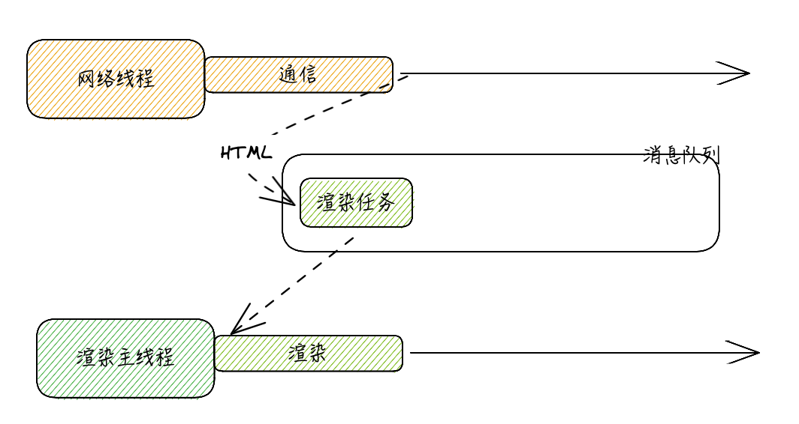
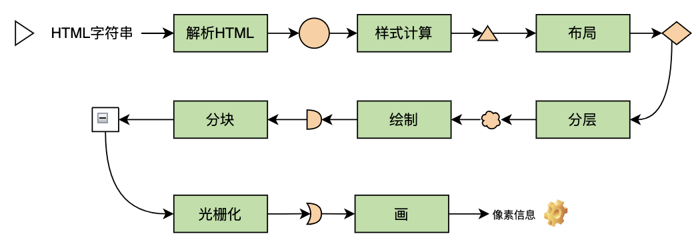
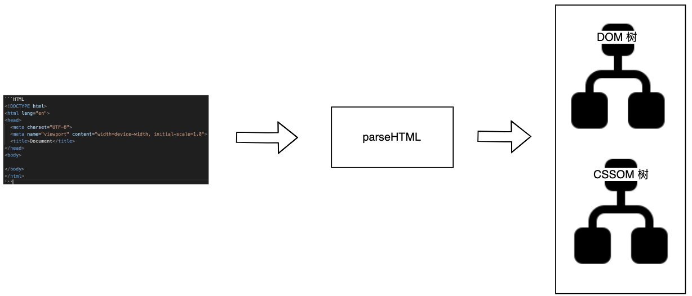
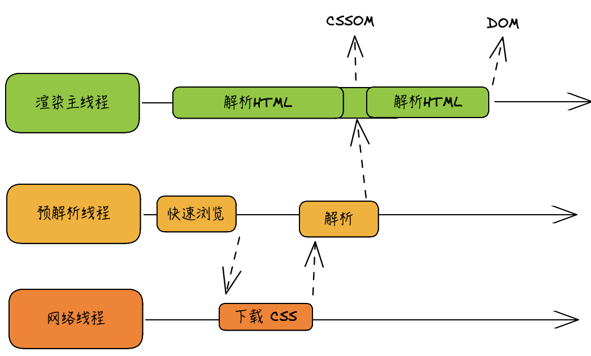
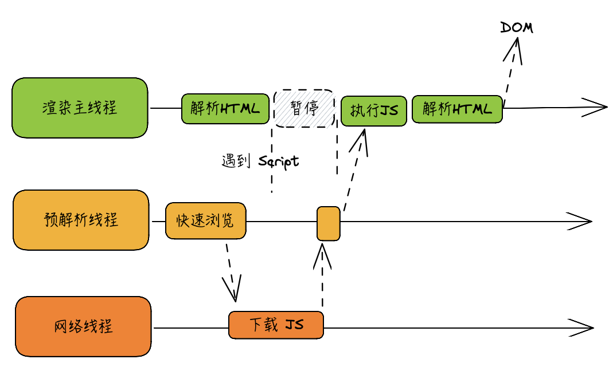
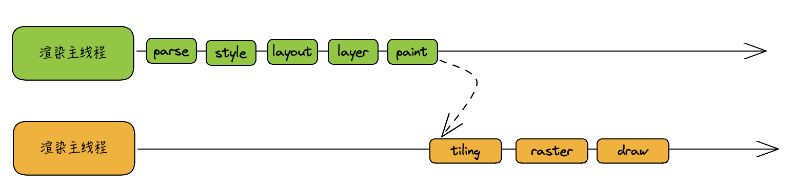

#### 渲染
将 HTML 字符串编程屏幕上的像素信息的过程

### ​渲染时间点

过程简介：网络线程收到HTML后，生成渲染任务放在消息队列，在事件循环机制的作用下，渲染主线程从消息队列取出渲染任务，开启渲染流程

**渲染流程如下图**

具体流程如下
### 1. 解析 HTML —— Parse HTML

DOM 树：Document Object Model
CSSOM 树：CSS Object Model

**HTML 解析过程遇到​ CSS** 

为了提高效率，浏览器会启动一个预解析器率先下载和解析 CSS，过程如下

注意：当主线程解析到 link 位置，外部 CSS 没有下载解析好，主线程不会等待，继续解析后续的 HTML。**CSS 解析和下载工作都在预解析线程进行，所以 CSS 不会阻塞 HTML**

**HTML 解析过程遇到 JS**

渲染主线程遇到 JS 时必须暂停一切行为，等待下载执行完后才能继续，预解析线程可以分担一点 JS 下载的任务，如下图

注意：当主线程解析到 script 位置，会停止解析 HTML，转而等待 JS 下载好，并将全局代码解析执行​完成后，才能继续解析 HTML。**因为 JS 执行过程中可能会修改当前 DOM 树，HTML 解析必须暂停，所以 JS 会阻塞 HTML 解析**

### 2. 样式计算 —— Recalculate Style

主线程会遍历得到的 DOM 树，依次为树中的每个节点计算出它最终的样式，称之为​ Computed Style

在这一过程中，很多预设值会变成绝对值，例如 red 会变成 rgb(255, 0, 0)​；相对单位会变成绝对单位，例如 em 会变成 px

### 3. 布局 —— Layout
布局阶段会依次遍历​ DOM 树的每个节点，计算每个节点的几何信息。例如节点的宽高、相对包含块的位置

DOM 树和 Layout 树不一定是一一对应的

​例如：display: none；的节点没有几何信息，​因此不会生成到布局树；使用伪元素选择器，​虽然 DOM 树中不存在伪元素节点，但它们有几何信息，所以会生成到布局树中。

匿名行盒、匿名块盒等都会导致 DOM 树和布局树无法一一对应​

### 4. 分层 —— Layer
主线程会使用一套复杂的策略对整个布局树进行分层

分层的好处在于，将来某一个层改变后，仅会对该层进行后续处理，从而提升效率

滚动条、堆叠上下文、transform、opacity等样式都会或多或少的影响分层结果，也可以通过 will-change 属性更大程度的影响分层结果

### 5. 绘制 —— Paint
主线程会为每个层单独产生绘制指令集，用于描述这一层的内容该如何画出来​

渲染主线程的工作到此为止，剩余步骤交给其他线程完成

### 6. 分块 —— 

完成绘制后，主线程将每个图层的绘制信息提交给合成线程，剩余工作将由合成线程完成

合成线程首先对每个图层进行分块，将其划分为更多的小区域

它会从线程池中拿去多个线程来完成分块工作

### 7. 光栅化 —— Raster
**将每个块变成位图，优先处理靠近视口的快​**

合成线程会将块信息交给 GPU 进程，以极高的速度完成光栅化

GPU 进程会开启多个线程来完成光栅化，

### 8. 画 —— Draw

​合成线程拿到每个层、每个块的位图后，生成一个个 「指引 quad」信息

指引会标识出每个位图应该画到屏幕的哪个位置，以及会考虑到旋转、缩放等变形

变形发生后合成线程，与渲染主线程无关 —— transform 效率高的本质

合成线程会把 quad 提交给 GPU 进程，由 GPU 进程产生系统调用，提交给 GPU 硬件，完成最终的屏幕成像​