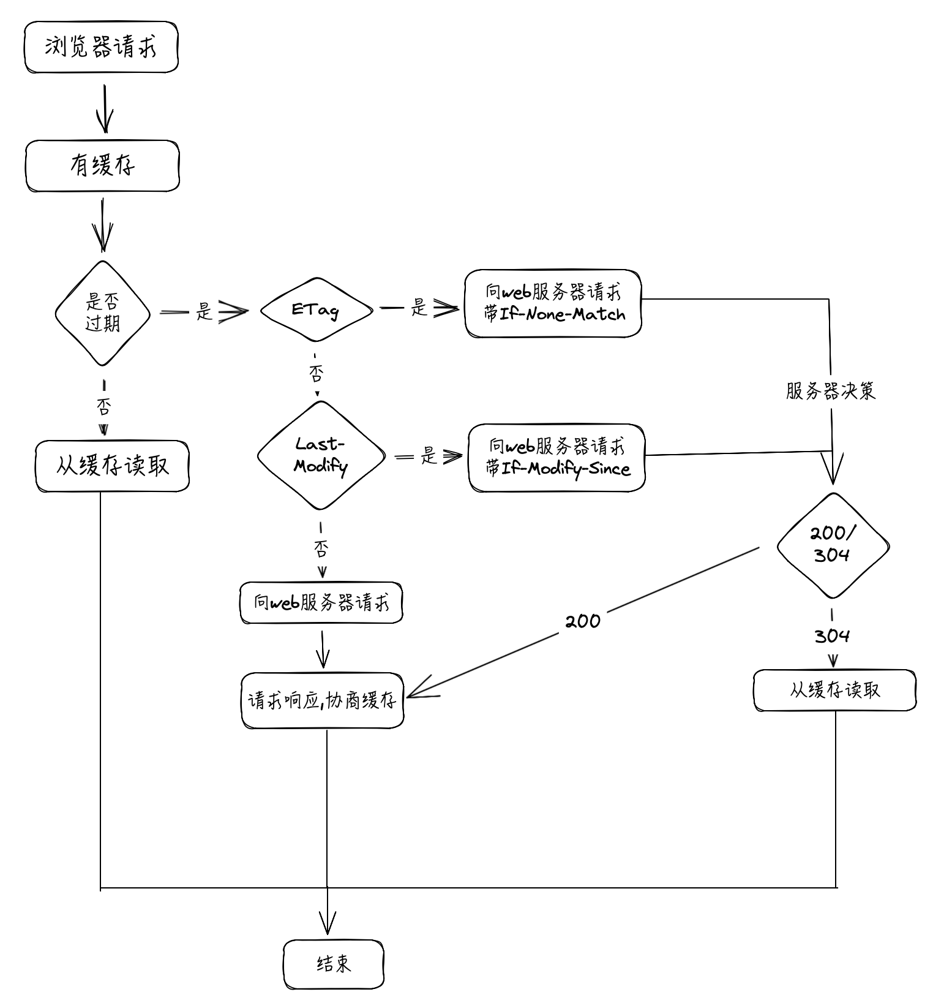

### HTTP 缓存

缓存原理：在首次请求后保存一份请求资源的响应副本，当用户再次发起相同请求后，如果判断缓存命中，则拦截请求，将之前存储的响应副本返回给用户，从而避免重新向服务器发起资源请求

种类：代理缓存、浏览器缓存、网关缓存等

### 浏览器缓存策略

浏览器缓存是浏览器在本地磁盘对用户最近请求过的文档进行存储，当访问者再次访问同一页面时，浏览器就可以直接从本地磁盘加载

浏览器判断缓存流程图：

### 优点
1. 减少冗余的数据传输，节省网费
2. 减少服务器的负担，大大提升网站的性能
3. 加快了客户端加载网页的速度

### 强制缓存

不会向服务器发送请求，直接从缓存中读取资源，在 chrome 控制台的 network 选项中可看到该请求返回状态码 200

### 协商缓存

在使用本地缓存之前，需要向服务器发送请求，服务器会根据这个请求的 request header 的参数来判断是否命中协商缓存。如果命中，则返回状态码 304 并带上新的 response header 通知浏览器从缓存中读取资源，协商缓存可以解决强制缓存下，资源不断更新的问题

两者的共同点是，都是从客户端缓存中读取资源；区别是强缓存不会发请求，协商缓存会发请求

### 强制缓存中 header 参数（响应头）

- Expires：response header 里的过期时间，浏览器再次加载资源时，如果在这个过期时间内，则命中强缓存

- Cache-Control：当值设置为 max-age=300 时，则代表在这个请求正确返回时间（浏览器也会记录下来）的 5 分钟内再次加载资源，就会命中强缓存。

Cache-Control 常用的设置值：
  - no-cahe：不使用本地缓存。需要使用协商缓存，先与服务器确认返回的响应是否被更改，如果之前的响应中存在 ETag，那么请求的时候会与服务端验证，如果资源未被更改，则可以避免重新下载

  - no-store：直接禁止浏览器缓存数据，每次用户请求该资源，都会向服务器发送一个请求，每次都会下载完整的资源

  - public：可以被所有的用户缓存，包括终端用户和 CDN 等中间代理服务器

  - private：只能被终端用户的浏览器缓存，不允许 CDN 等中继缓存服务器对其缓存

**Expires 设置以分钟为单位的绝对过期时间，设置相对过期时间；max-age 指明以秒为单位的缓存时间**

### 协商缓存中 header 的参数

设置协商缓存 Cache-Control: no-cache

- Last-Modify/If-Modify-Since：浏览器第一次请求一个资源的时候，服务器返回的 header 中会加上 Last-modify 是一个时间标识该资源的最后修改时间；当浏览器再次请求该资源时，request 的请求头中会包含 If-Modify-Since，该值为缓存之前返回的 Last-Modiy。服务器收到 If-Modify-Since 后，根据资源的最后修改时间判断是否命中缓存

  **Last-Modify 的值是资源最后修改时间**

- ETag/If-Nono-Match：web 服务器响应请求时，告诉浏览器当前资源在服务器的唯一标识（生成规则由服务器决定）。If-None-Match：发现资源具有 ETag 声明，则再次向 web 服务器请求时带上头 If-None-Match（ETag的值）。web 服务器收到请求后发现有头 If-None-Match 则与被请求资源的相应校验串进行对比，决定是否命中协商缓存；

  **ETag 的值是资源文件对应的 hash 值（但是会加大服务器开销，这个 hash 需要生成）**

ETag 和 Last-Modify 区别：

1. 要优于 Last-Modify。Last-Modify 的时间单位是秒，如果某个文件在 1 秒内改变了很多次，那么他们的 Last-Modify 其实并没有体现出修改，但是 ETag 每次都会改变确保了精度
2. 性能上 ETag 劣于 Last-Modify，Last-Modify 只需要记录时间，而 ETag 需要服务器通过算法计算一个 hash 值

