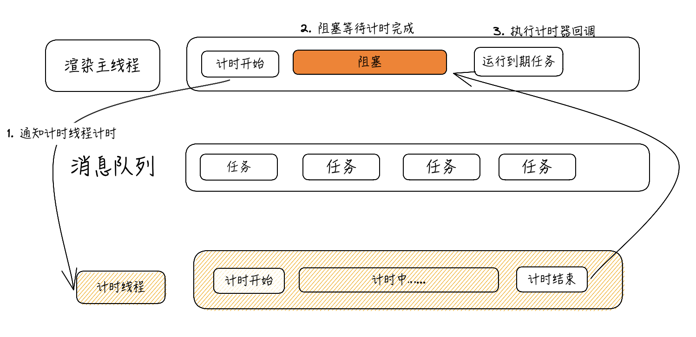

事件循环是浏览器的核心原理

#### 浏览器的进程模型

#### 进程

程序运行需要有自己专属的内存空间，可以把这块内存空间称为进程

每个应用至少有一个进程，进程之间相互独立，即使要通信，也需要双方同意

#### 线程

有了进程后，就可以运行代码了，而运行代码的“人”称之为“线程”

一个进程至少有一个线程，所以在进程开启后会自动创建一个线程来运行代码，该线程称之为主线程（主线程结束，则整个程序结束）

#### 浏览器有哪些进程和线程

浏览器是一个多进程多线程的应用程序


​
主要进程有

1. 浏览器进程
   - 负责页面显示、用户交互、​ 子进程管理等。浏览器进程内部会启动多个线程处理 ​ 不同的任务
2. ​ 网络进程
   - 负责加载网络资源。网络进程内部会启动多个线程来处理不同的网络任务
3. 渲染进程
   - 渲染进程启动后，会开启一个渲染主线程，主线程负责执行 HTML、CSS、JS 代码
   - 默认情况下，浏览器会为每个标签页开启一个新的渲染进程，以保证不同的标签页之间不相互影响

### 渲染主线程是如何工作的？

渲染主线程主要工作

- 解析 HTML
- 解析 CSS
- 计算样式
- 布局
- 处理图层
- 每秒把页面画 60 次：FPS 帧
- 执行全局 JS 代码
- 执行事件处理函数
- 执行计时器的回调函数
- ......

主线程任务调度

- 正在执行 JS 函数，用户点击了按钮，应该怎么办？
- 正在执行 JS 函数，计时器到时了，应该怎么办？
- 用户点击按钮的同时，计时器到时了，怎么办？

**排队**


1. 最开始的时候，渲染主线程会进入一个无限循环
2. 每次循环会检查消息队列中是否有任务存在。如果有，取出第一个执行，执行完一个后进入到下一次循环；如果没有，则休眠
3. 其他所有线程（包括其他进程的线程）可以随时向消息队列添加任务。新任务会加到消息队列的末尾。在添加新任务时，如果主线程是休眠状态，则会将其唤醒以继续循环拿取任务

### 解释

#### 异步

代码执行过程中，会遇到无法立即处理的任务，eg：

- 计时完成后需要执行的任务 —— setTimeout、setInterval
- 网络通信完成后需要执行的任务 —— XHR、Fetch
- 用户操作后需要执行的任务 —— addEventListener

若让渲染主线程等待这些任务的时机完成，会导致主线程长期处于**阻塞**状态,从而导致浏览器**卡死**，如下图



**渲染主线程承担着极其重要的责任，不能被阻塞**，所以浏览器选择了异步，如下图


使用异步方式，​ 渲染主线程永不阻塞

#### JS 为何会阻碍渲染

```html
<h1>JS is awesome!</h1>

<button>change</button>

<script>
  var h1 = document.querySelector("h1");
  var btn = document.querySelector("button");

  // 死循环指定的时间
  function delay(duration) {
    var start = Date.now();
    while (Date.now() - start < duration) {}
  }

  btn.onclick = function () {
    h1.textContent = "delay here";
    delay(3000);
  };
</script>
```
1. 渲染主线程 执行全局JS，将点击事件交给交互线程，主线程休眠
2. 交互线程 监听按钮点击，点击后执行fn
3. 用户点击按钮后，交互线程将fn放在消息队列中，唤醒渲染主线程
4. 主线程执行fn，设置 h1 的 text，产生新任务——绘制任务，放在消息队列，主线程继续执行 delay 死循环，循环结束，主线程闲置
5. 拿消息队列中的绘制任务执行

执行 delay 过程中的其他事件都在消息队列中等待
**​总结**：JS 的执行和渲染都在​一个线程中执行，当 JS 执行时间过长，自然阻塞渲染

#### 任务优先级

任务没有优先级，在消息队列中先进先出，但消息队列​有优先级

**w3c​最新解释：**
- 每个任务都有一个任务类型，同一个类型的任务必须在一个队列，不同类型的任务可以分属不同的队列​。在一次事件循环中，浏览器可以根据实际情况从不同的队列中取出任务执行

- 浏览器必须准备好一个微队列，微队列中的任务优先所有其他任务执行

目前 chrome 包含的队列：

- 延时队列：用于存放计时器结束后的回调任务，优先级 **中**

- 交互队列：用于存放用户操作后产生的事件处理任务，优先级 **高**

- 微队列：用户存放需要最快执行的任务，优先级 **最高**
