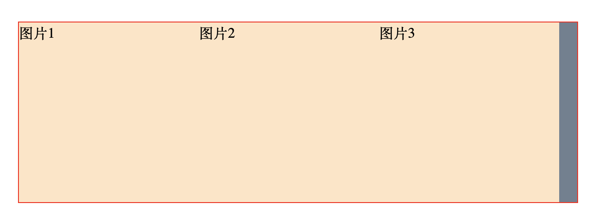

涉及 git repo：[demo repo](https://github.com/qiqzhao/css-demo/tree/main/margin-minus)

### 效果

- margin-left：自身向左移动
- margin-top：自身向上移动
- margin-right：自身向右移动
- margin-bottom：自身向下移动

### 应用

- 增加宽度
- 圣杯布局
- 双飞翼布局

1. 增加宽度

```html
<!DOCTYPE html>
<html lang="en">
  <head>
    <meta charset="UTF-8" />
    <meta name="viewport" content="width=device-width, initial-scale=1.0" />
    <title>Document</title>

    <style>
      * {
        margin: 0;
        padding: 0;
      }

      .box {
        width: 620px;
        margin: 50px auto;
        border: 1px solid red;
      }

      .box ul {
        overflow: hidden;
        background-color: slategray;
      }

      .box li {
        list-style: none;
        float: left;
        width: 200px;
        height: 200px;
        background-color: bisque;
      }
    </style>
  </head>
  <body>
    <div class="box">
      <ul>
        <li>图片1</li>
        <li>图片2</li>
        <li>图片3</li>
      </ul>
    </div>
  </body>
</html>
```

效果


让每个图片右侧有 10px 间距

```css
.box li {
  margin-right: 10px;
}
```

**图片 3 被挤下来了**

```css
.box {
  overflow: hidden;
}

.box ul {
  /* 增加 ul 宽度 */
  margin-right: -10px;
}
```

效果 **perfect!!**


2. 圣杯布局
   三列布局，中间元素宽度自适应，左右两边固定宽度
   

baisc code:

```html
<!DOCTYPE html>
<html lang="en">
  <head>
    <meta charset="UTF-8" />
    <meta name="viewport" content="width=device-width, initial-scale=1.0" />
    <title>Document</title>

    <style>
      * {
        margin: 0;
        padding: 0;
      }

      .container {
        background-color: slategray;
      }

      .item {
        color: white;
      }

      .content {
        height: 200px;
        background-color: steelblue;
      }

      .left-item {
        width: 100px;
        background-color: slateblue;
      }

      .right-item {
        width: 150px;
        background-color: green;
      }
    </style>
  </head>
  <body>
    <div class="container">
      <div class="content item">main content</div>
      <div class="left-item item">left item</div>
      <div class="right-item item">right item</div>
    </div>
  </body>
</html>
```

css 实现

```css
.container {
  padding-left: 100px;
  padding-right: 150px;
}
.item {
  float: left;
}
.content {
  width: 100%;
}

.left-item {
  margin-left: -100%;
  position: relative;
  right: 100px;
}

.right-item {
  margin-right: -100%;
}
```

3. 双飞翼布局

左右宽度固定，中间宽度自适应，中间内容优先加载


basic code

```html
<!DOCTYPE html>
<html lang="en">
  <head>
    <meta charset="UTF-8" />
    <meta name="viewport" content="width=device-width, initial-scale=1.0" />
    <title>双飞翼布局</title>

    <style>
      * {
        margin: 0;
        padding: 0;
      }

      .item {
      }

      .container {
        background-color: slategray;
      }
      .content {
        height: 200px;
        background-color: brown;
      }
      .left-item {
        width: 200px;
        background-color: violet;
      }

      .right-item {
        width: 150px;
        background-color: burlywood;
      }
    </style>
  </head>
  <body>
    <div class="container item">
      <div class="content">main content</div>
    </div>

    <div class="left-item item">left item</div>
    <div class="right-item item">right item</div>
  </body>
</html>
```

css 实现

```css
.box {
  /* 清除浮动 */
  overflow: hidden;
}
.item {
  float: left;
}
.container {
  width: 100%;
}
.content {
  /* 两边预留空间 */
  margin-left: 200px;
  margin-right: 150px;
}
.left-item {
  margin-left: -100%;
}

.right-item {
  margin-left: -150px;
}
```

添加 box div 清除浮动，使用 BFC

```html
<div class="box">
  <div class="container item">
    <div class="content">main content</div>
  </div>

  <div class="left-item item">left item</div>
  <div class="right-item item">right item</div>
</div>
```
