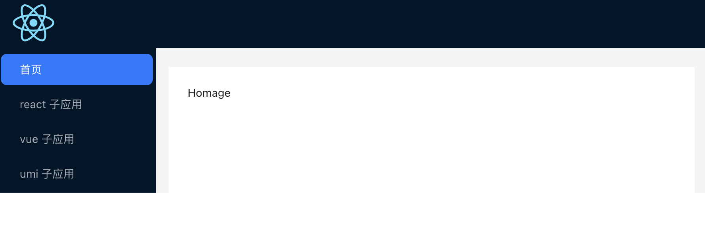

### 什么是微前端

指存在于浏览器中的微服务，解决了微服务架构理念，将微服务的概念扩展到前端



#### 好处

- **团队自治**
- **技术灵活**
- **独立开发部署**
- **业务柯颗粒化**
- **兼容老项目**

### 现有微前端方案

#### iframe

每个子应用通过 iframe 标签来嵌入到父应用中，iframe 具有天然的隔离属性，各个子应用以及子应用和父应用之间都可以做到互不影响

缺点：

- url 不同步，如果刷新页面，iframe 中的页面路由会丢失
- 全局上下文完全隔离，内存变量不共享
- UI 不同步，比如 iframe 中的页面如果有带有遮罩层的弹框组件，则不能覆盖整个浏览器，只能在 iframe 中生效
- 慢，每次子应用进入都是一次浏览器上下文重建、资源重新加载的过程

#### single-spa

首先在基座中注册所有子应用的路由，当 URL 改变时就会去进行匹配，匹配到哪个子应用就会去加载对应的子应用。

相对于 iframe 的实现方式，single-spa 中基座和各个子应用之间共享着一个全局上下文，并且不存在 URL 不同步和 UI 不同步的情况，但是 single-spa 有如下**缺点：**

- 没有实现 js 隔离和 css 隔离
- 需要修改大量的配置，包括基座和子应用的，不能开箱即用

#### qiankun

阿里开源的微前端框架，**优势：**

- 基于 single-spa 封装的，提供了更加开箱即用的 API
- 技术栈无关，任意技术栈的应用均可使用/接入
- HTML Entry 的方式接入，像使用 iframe 一样简单
- 实现了 single-spa 不具备的样式隔离和 js 隔离
- 资源预加载，在浏览器空闲时间加载未打开的微应用资源，加速微应用的打开速度

### qiankun 实践

目录：

```shell
├─── micro-base # 基座
├─── sub-react # react 子应用
├─── sub-vue # vue 子应用
└─── sub-umi # umi 创建的子应用
```

#### 基座

##### 创建

```shell
npx create-react-app micro-base --template typescript
```

##### 改造

- 安装 qiankun

```shell
npm i -S qiankun
```

- 修改入口文件 src/index.tsx

```tsx
import React from "react";
import ReactDOM from "react-dom/client";
import "./index.css";
import App from "./App";
import reportWebVitals from "./reportWebVitals";

import { start, registerMicroApps } from "qiankun";

const root = ReactDOM.createRoot(
  document.getElementById("root") as HTMLElement
);

root.render(
  <React.StrictMode>
    <App />
  </React.StrictMode>
);

reportWebVitals();

const apps = [
  {
    name: "sub-react",
    entry: "//localhost:3002",
    activeRule: "sub-react",
    container: "#sub-app",
  },
  {
    name: "sub-vue",
    entry: "//localhost:5173",
    activeRule: "sub-vue",
    container: "#sub-app",
  },
];

registerMicroApps(apps, {
  beforeLoad: [async (app) => console.log("before load", app.name)],
  beforeMount: [async (app) => console.log("before mount", app.name)],
  afterMount: [async (app) => console.log("after mount", app.name)],
});

start();
```

- registerMicroApps(apps, lifeCycles?)：注册所有子应用，qiankun 会根据 activeRule 去匹配对应的子应用并加载
- start(options?)：启动 qiankun，可以进行预加载和沙箱设置

#### react 子应用

- 修改入口文件 index.tsx

```tsx
import { createRoot, Root } from "react-dom/client";
import "./index.css";
import App from "./App";
import reportWebVitals from "./reportWebVitals";
import { BrowserRouter } from "react-router-dom";
import "./public-path.js";

reportWebVitals();

let root: Root;
function render(props: any) {
  const { container } = props;
  const dom = container
    ? container.querySelector("#root")
    : document.getElementById("root");

  root = createRoot(dom);
  root.render(
    <BrowserRouter basename="/sub-react">
      <App />
    </BrowserRouter>
  );
}

// 判断是否在 qiankun 环境下，非 qiankun 环境下独立运行
if (!(window as any).__POWERED_BY_QIANKUN__) {
  render({});
}

// 只会在微应用初始化调用
export async function bootstrap() {
  console.log("sub react to bootstraped");
}

export async function mount(props: any) {
  render(props);
}

export async function unmount(props: any) {
  root.unmount();
}
```

- 新增 public-path.js

```js
if (window.__POWERED_BY_QIANKUN) {
  // 动态设置 webpack publicPath，防止资源加载出错
  // eslint-disable-next-line no-undef
  __webpack_public_path__ = window.INJECTED_PUBLIC_PATH_TO_QIANKUN__;
}
```

- 修改 webpack 配置

安装依赖

```shell
npm i -D react-app-rewired
```

创建 config.overrides.js 文件

```js
const { name } = require("./package.json");

module.exports = {
  webpack: (config) => {
    config.output.library = `${name}-[name]`;
    config.output.libraryTarget = "umd"; // umd 模块，方便 qiankun 读取声明周期
    config.output.chunkLoadingGlobal = `webpackJson_${name}`;
    return config;
  },
};
```

#### vue 子应用

- 安装依赖 vite-plugin-qiankun

```shell
npm i -S vite-plugin-qiankun
```

- 修改 vite.config.js

```js
import { defineConfig } from "vite";
import vue from "@vitejs/plugin-vue";
import qiankun from "vite-plugin-qiankun";

// https://vitejs.dev/config/
export default defineConfig({
  base: "/sub-vue",
  plugins: [
    vue(),
    qiankun("sub-vue", {
      useDevMode: true,
    }),
  ],
});
```

- 修改 main.js

```js
import { createApp } from "vue";
import "./style.css";
import App from "./App.vue";
import {
  renderWithQiankun,
  qiankunWindow,
} from "vite-plugin-qiankun/dist/helper";

let app: any;

if (!qiankunWindow.__POWERED_BY_QIANKUN__) {
  createApp(App).mount("#app");
} else {
  renderWithQiankun({
    mount(props) {
      app = createApp(App);
      app.mount(props.container?.querySelector("#app"));
    },
    bootstrap() {
      console.log(" sub vue bootstrap");
    },
    update() {
      console.log(" sub vue update");
    },
    unmount() {
      console.log(" sub vue unmount");
      app?.unmount();
    },
  });
}
```

> - mount： 子应用挂载
> - bootstrap：只有子应用第一次加载会触发
> - update：更新
> - unmount：卸载

#### umi 子应用

- 安装依赖

```shell
npm i -S @umijs/plugins
```

- 配置 .umirc.ts

```ts
import { defineConfig } from "umi";

export default defineConfig({
  base: "sub-umi",
  routes: [
    { path: "/", component: "index" },
    { path: "/docs", component: "docs" },
  ],
  plugins: ["@umijs/plugins/dist/qiankun"],
  qiankun: {
    slave: {},
  },
  npmClient: "npm",
});
```

### 附

源码：[qiankun-micro-app](https://github.com/qiqzhao/qiankun-micro-app)
