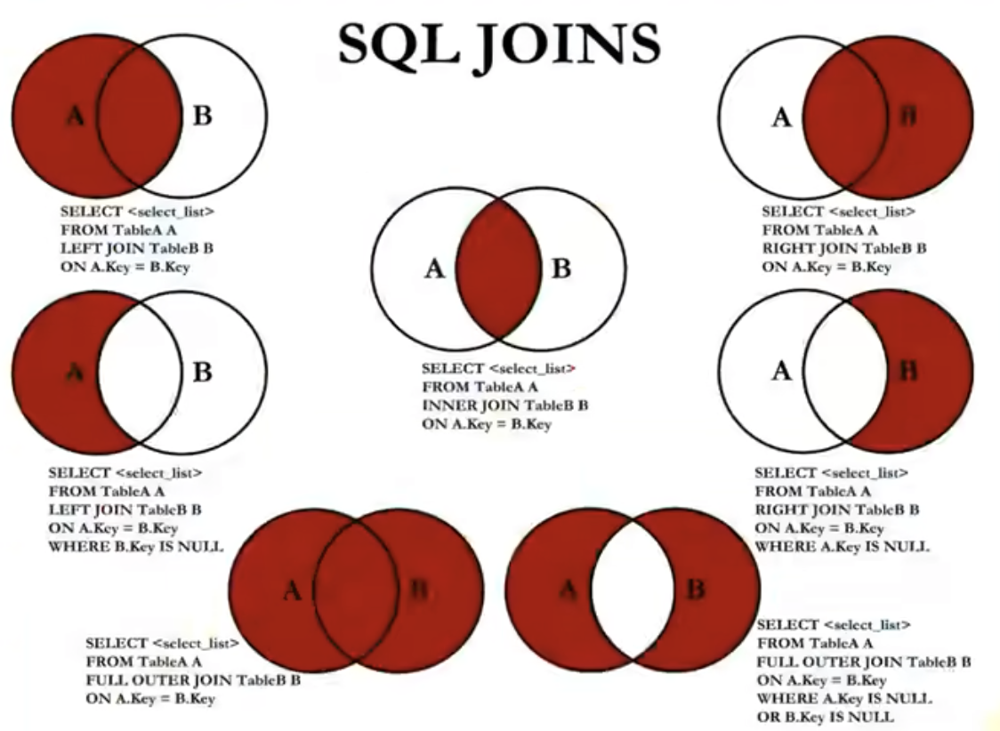

In Progress

### 前言

```shell
# docker 启动 mysql
docker run -d --name mysql -p 3306:3306 -e MYSQL_ROOT_PASSWORD=root mysql

# 进入 mysql container
docker exec -it 436d2fdfe14c bash

# 连接 mysql
mysql -u -p

# 输入 password
root
```

### SELECT 语句

- 基本用法

```SQL
select  1, 1+1, 3 *2;

# DUAL 伪表
select  1, 1+1, 3 *2
from DUAL;
```

- 查询所有字段（\*）

```sql
select * from employees;
```

- 列别名

```sql
select employee_id emp_id from employees;
```

- 去除重复行

```sql
select distinct department_id
from employees;
```

- 空值(NULL)参与运算

当 commision_pct 为 null 时，计算的年工资为 null，可以使用 ifnull 来解决

```sql
select employee_id, salary "月工资" salary * ( 1+ commission_pct) * 12 "年工资" from employees;
```

- 着重号 ``: 表名或字段名和关键字重复时使用

```sql
select * from `order`
```

- 显示表结构

显示表中字段的详细信息

```sql
describe employee;
```

- where 条件

```sql
select *
from emplyee
where department_id = 90;
```

### 运算符

#### 算数

- \+
- \-
- \*
- \/
- \%

```sql
# 加减

select 100, 100 + 0, 100 - 0, 100 + 50, 100 + 50 * 30
from dual;

# 输出为 101
select 100 + '1'
from dual;


# 输出为 100，'a' 无法转为数字，则视为 0
select 100 + 'a'
from dual;

# 乘除

# 输出为 100,100， 100.0， 100.0000， 50.0000
# 分母为 0，结果为 null
select 100, 100 * 1, 100 * 1.0, 100 / 1.0, 100 / 2
from dual;

# %
# 输出 0， 2， 2， -2， -2
select 12 % 3, 12 % 5, 12 mod -5, -12 % 5, -12 % -5
from dual;
```

#### 比较

- = 等于
- <=> 安全等于
- <>(!=) 不等于
- < 小于
- <=
- \>
- \>=

关键字

- is null 为空
- is not null 不为空
- least 最小值
- greatest 最大值
- between and 两者之间
- isnull 为空
- in 属于
- not in 不属于
- like 模糊匹配
- regexp 正则表达式
- rlike 正则表达式

#### 逻辑

- not 或 !
- and 或 &&
- or 或 ||
- xor 异或

#### 位

- & 与
- | 或
- ^ 异或
- ~ 取反
- \>> 右移
- \<< 左移

### order by 排序

规则

- 默认是，数据添加顺序（**不加 order by**）
- asc 升序（**加 order by 的默认值**）
- desc 降序

```sql
select employee_id, last_name, salary
from employees;
order by salary;

# 二级排序，多列排序
select employee_id, salary, department_id
from employees;
order by department_id desc, salary asc;
```

### limit 分页

**格式**  
limit 位置偏移量,条目数

```sql
# 每页显示20条记录，此时第1页
select *
from employees
limit 0,20;

# 每页显示20条记录，此时第2页
select *
from employees
limit 20,20;

# 每页显示pageSize条记录，此时第pageNo页
select *
from employees
limit (pageNo - 1) * pageSize,pageSize;
```

**where、 order by、 limit 顺序**

```sql
select *
from employees
where salary > 6000
order by salary desc
limit 10;
```

### 多表查询

```sql
select *
from employees e, departments d
where e.department_id = d.department_id;
```

**笛卡尔积（或交叉连接）**  
是一个数学运算。假设我有两个集合 X 和 Y，那么 X 和 Y 的笛卡尔积就是 X 和 Y 的所有可能组合，也就是第一个对象来自于 X，第二个对象来自于 Y 的所有可能。组合的个数即为两个集合元素个数的乘积数。

**内连接**：合并具有同一列的两个以上的表的行，结果集中不包含一个表与另一个表不匹配的行

**外连接**：合并具有同一列的两个以上的表的行，结果集中不包含一个表与另一个表不匹配的行外，还查询到了坐表或右表中不匹配的行

#### union 合并查询

- union -> 返回两个查询结果集的并集，去除重复记录
- union all -> 返回两个查询的结果集的并集，并对两个结果集的重复部分，不去重

> 注意：执行 union all 所需要的资源比 union 少。
> 结论：如果明确知道合并数据后的结果数据不存在重复数据，或者不需要去重，则尽量使用 union all，提高查询效率

#### join



```sql
# 中图 内连接
select *
from A join B
on A.d_id = B.d_id;

# 左上图 左外连接
select *
from A left join B
on A.d_id = B.d_id;

# 右上图 右外连接
select *
from A right join B
on A.d_id = B.d_id;

# 左中图
select *
from A left join B
on A.d_id = B.d_id;
where B.d_id is null;

# 右中图
select *
from A right join B
on A.d_id = B.d_id;
where A.d_id is null;

# 左下图 满外连接
# 方式1：左上 union all 右中
select *
from A left join B
on A.d_id = B.d_id
union all
select *
from A right join B
on A.d_id = B.d_id;
where A.d_id is null;
# 方式2： 左中  union all 右上
select *
from A left join B
on A.d_id = B.d_id;
where B.d_id is null
union all
select *
from A right join B
on A.d_id = B.d_id;


# 右下图：左中 union all 右中
select *
from A left join B
on A.d_id = B.d_id;
where B.d_id is null
union all
select *
from A right join B
on A.d_id = B.d_id;
where A.d_id is null;
```

**natural join**：会自动查询两张表中，所有相同的字段，然后进行连接

**using**：当两张表中连接的字段名称相同时，使用

```sql
select *
from A join B
on A.d_id = B.d_id;
using(d_id)
```
