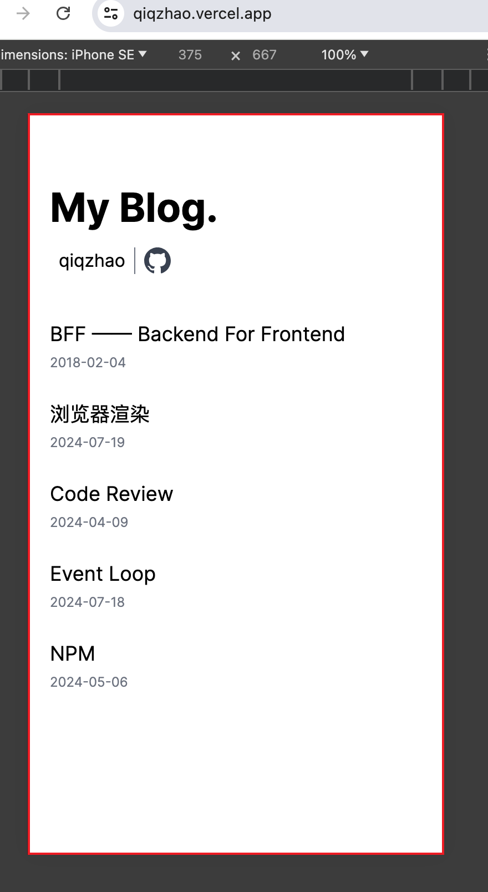

### 基本概念

- px: 像素 pixel 缩写
- em: 相对单位， 1em 等于当前元素的 1 font-size 的大小
- rem: CSS3 新增的相对单位，1rem 等于 html 的 1 font-size 大小
- vw 和 vh: 相对单位，1vw 是视口宽度的 1%，1vh 是视口高度的 1%

### 视口

视口 ≠ 屏幕大小，视口去掉浏览器头尾



### em 使用场景

- 首行缩进

```css
// 首行缩进两个汉字
.container {
  width: 100px;
  height: 100px;
  text-indent: 2em;
  font-size: 20px;
  background-color: gray;
}
```

- em 限制一行显示字数

```css
// 一行显示5个汉字
.container {
  width: 5em;
  height: 200px;
  font-size: 20px;
  background-color: gray;
}
```

### rem
只跟 html 字体大小有关

通过用于移动端，配合媒体查询或 js 动态进行移动端适配

### vw vh
相对视口的大小

例如 80vw，表示 视口宽度的 80%


### 扩展

#### vmax
vh 和 vw 中较大的值

#### vmin
vh 和 vw 中较小的值

#### 使用场景

如果某个元素在手机横屏和竖屏时，大小保持一致，可以考虑使用 vmax 或 vmin